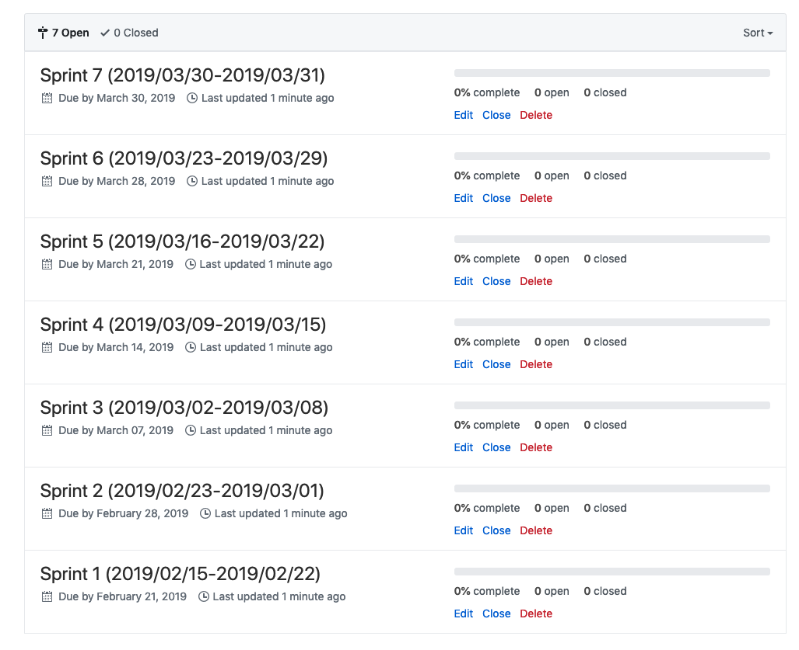

# github-sprinter

CLI managing GitHub milestones as sprints with YAML file.  
Strongly inspired by [b4b4r07/github-labeler](https://github.com/b4b4r07/github-labeler).



## Installation

```
$ go get -u github.com/micnncim/github-sprinter/cmd/github-sprinter
```

## Usage

```
$ github-sprinter
```

Specify manifest (default=`sprint.yaml`).

```
$ github-sprinter -manifest manifest.yaml
```

Support dry-run.

```
$ github-sprinter -dry-run
```

Update (including deletion) available.  
If not specify `-update`, `github-sprinter` will not delete any milestone.
Even though `github-sprinter` delete some milestones, only `open` milestones will deleted.

```
$ github-sprinter -update
```

## Manifest example

```yaml
sprint:
  title_format: Sprint {{ .SID }} ({{ .StartOn }}-{{ .DueOn }})
  duration: 168h # 1 week (24h * 7d = 168h)
  terms:
    - start_on: 2019/04/01
      due_on: 2020/03/31
    - start_on: 2020/04/01
      due_on: 2021/03/31
  ignore:
    terms:
      - start_on: 2019/08/01
        due_on: 2019/08/14
      - start_on: 2019/12/27
        due_on: 2020/01/01
    edge_weekdays:
      - Saturday
      - Sunday

repos:
  - name: micnncim/github-sprinter
```

## LICENSE

[MIT](./MIT)