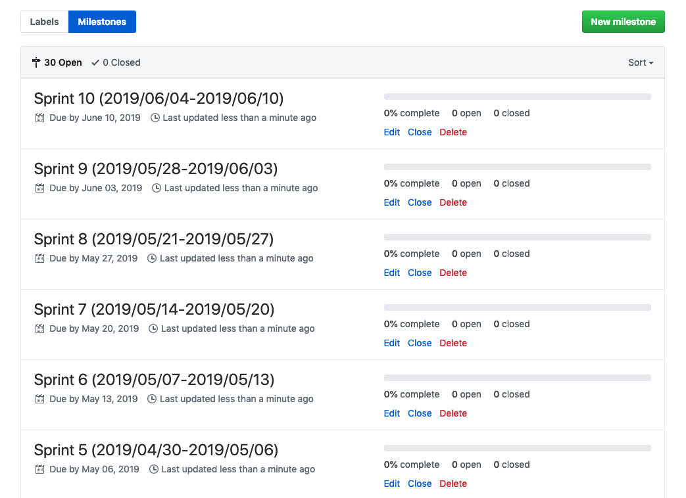

# github-sprinter

CLI managing GitHub milestones as sprints with YAML file.  
Strongly inspired by [b4b4r07/github-labeler](https://github.com/b4b4r07/github-labeler).



## Installation

```
$ go get -u github.com/micnncim/github-sprinter/cmd/github-sprinter
```

## Usage

```
$ github-sprinter
```

Specify manifest (default=`sprint.yaml`).

```
$ github-sprinter -manifest manifest.yaml
```

Support dry-run.

```
$ github-sprinter -dry-run
```

Update (including deletion) available.  
If not specify `-update`, `github-sprinter` will not delete any milestone and will create some milestones.
Even though `github-sprinter` deletes some milestones, only `open` milestones will deleted.

```
$ github-sprinter -update
```

## Manifest example

```yaml
sprint:
  title_format: Sprint {{ .SID }} ({{ .StartOn }}-{{ .DueOn }})
  duration: 168h # 1 week (24h * 7d = 168h)
  terms:
    - start_on: 2019/04/01
      due_on: 2020/03/31
    - start_on: 2020/04/01
      due_on: 2021/03/31
  ignore:
    terms:
      - start_on: 2019/08/01
        due_on: 2019/08/14
      - start_on: 2019/12/27
        due_on: 2020/01/01
    edge_weekdays:
      - Saturday
      - Sunday

repos:
  - name: micnncim/github-sprinter
```

### Use case

#### `-update`

- Change duration of each sprint

Change `sprint.duration` (`sprint.title_format` `sprint.terms` `sprint.ignore`)
:warning: This operation **DELETE**s all open milestone once and creates new milestones

```diff
sprint:
- duration: 168h # 1 week (24h * 7d = 168h)
+ duration: 120h # 5 days (24h * 5d = 120h)
```

- Remove all milestones from some repository

Remove all `sprint.terms` and stay `repos.name`

```diff
sprint:
  terms:
-    - start_on: 2019/04/01
-      due_on: 2020/03/31
-    - start_on: 2020/04/01
-      due_on: 2021/03/31

repos:
  - name: micnncim/github-sprinter
```

#### not `-update`

- Add repository for the existing milestones

Remove the repositories where you don't want to change anything and add the repositories you want

```diff
repos:
- - name: micnncim/github-sprinter-1
- - name: micnncim/github-sprinter-2
+ - name: micnncim/github-sprinter-3
```


## LICENSE

[MIT](./MIT)